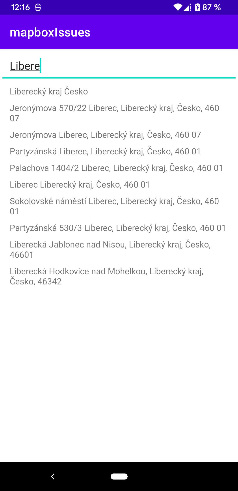
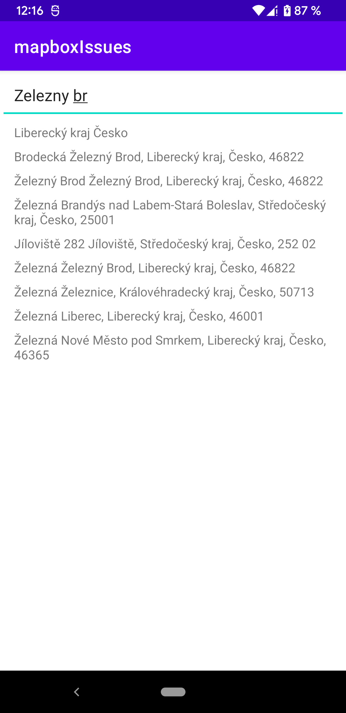
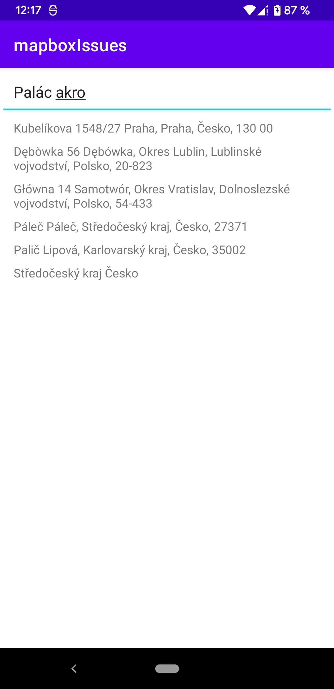

# Mapbox Android SDK issues

## Preparation
- Edit `local.properties` file and add: 
```
MAPBOX_ACCESS_TOKEN=pk.ey...
MAPBOX_DOWNLOADS_TOKEN=sk.ey...
```

## Issues:
### Format of result
We must use MapboxExtensions.kt > `SearchAddress.toAddressFormat` format for custom format address, 
because mapbox does not respect local address format. It's not possible use `SearchAddress.FormatStyle.Custom()` because it put comma between all items. 

Expected SDK format for suggestion `Bořivojova 85`: `Bořivojova 85, Praha, 130 00`

Current SDK format: `85 Bořivojova, Praha, Praha, Česko, 13000`

[API/playground](https://docs.mapbox.com/playground/geocoding/?search_text=Bo%C5%99ivojova%2085&country=cz%2Csk%2Cpl&limit=10&types=place%2Cpostcode%2Caddress%2Cpoi&language=cs&access_token=pk.xxx) 
returns correct format: `place_name:"Bořivojova 85, 13000 Praha, Praha, Česko"` but Android SDK not, even we set proper language in `SearchOptions`.

### Search results
- `Libere` should show first [Liberec](https://docs.mapbox.com/playground/geocoding/?search_text=Libere&country=cz%2Csk%2Cpl&limit=10&types=place%2Cpostcode%2Caddress%2Cpoi&language=cs&access_token=pk.xxx) city
- `Zelezny br` should show first [Železný Brod](https://docs.mapbox.com/playground/geocoding/?search_text=Zelezny%20br&country=cz%2Csk%2Cpl&limit=10&types=place%2Cpostcode%2Caddress%2Cpoi&language=cs&access_token=pk.xxx)  city
- `Pelecho` should show first [Pelechov](https://docs.mapbox.com/playground/geocoding/?search_text=Pelecho&country=cz%2Csk%2Cpl&limit=10&types=place%2Cpostcode%2Caddress%2Cpoi&language=cs&access_token=pk.xxx) - village near Železný Brod [Pelechov missing at all](https://goo.gl/maps/QAaRfMhXRVBnTv6A7) 
- `Palác Akro` should show first [Palác Akropolis](https://docs.mapbox.com/playground/geocoding/?search_text=Pal%C3%A1c%20akro&country=cz%2Csk%2Cpl&limit=10&types=place%2Cpostcode%2Caddress%2Cpoi&language=cs&access_token=pk.xxx) (POI), expect Name of POI + address, result is only Address, but I as custommer don't know address and need to know, that's the POI name which I expect...

Results are different from your playground.

- POI missing names
- Cities are shown as Regions
- Villages missing (Pelechov)

## From original email:
`SearchSDK: search(Liberec, SearchOptions(proximity=null, boundingBox=null, countries=[Country(code='cz'), Country(code='pl'), Country(code='sk')], fuzzyMatch=null, languages=[Language(code='cs')], limit=10, types=[ADDRESS, POSTCODE, POI, PLACE], requestDebounce=null, origin=null, navigationOptions=null, routeOptions=null, unsafeParameters=null, ignoreIndexableRecords=false, indexableRecordsDistanceThresholdMeters=null)) called 2`

`postJsonEvent: {"country":["cz","pl","sk"],"created":"2022-03-30T13:31:29+0200","endpoint":"https://api.mapbox.com/geocoding/v5/mapbox.places/suggest","event":"search.query_change","language":["cs"],"newQuery":"Liberec","oldQuery":"Libere","sessionIdentifier":"a57df118-ec4d-4805-826f-66f55faecb9c","types":[8,2,9,4],"userAgent":"search-sdk-android/1.0.0-beta.28"} 3`

`Parsed event: QueryChangeEvent(event=search.query_change, created=2022-03-30T13:31:29+0200, latitude=null, longitude=null, sessionIdentifier=a57df118-ec4d-4805-826f-66f55faecb9c, userAgent=search-sdk-android/1.0.0-beta.28, boundingBox=null, autocomplete=null, routing=null, country=[cz, pl, sk], types=[8, 2, 9, 4], endpoint=https://api.mapbox.com/geocoding/v5/mapbox.places/suggest, orientation=null, proximity=null, fuzzyMatch=null, limit=null, language=[cs], keyboardLocale=null, mapZoom=null, mapCenterLatitude=null, mapCenterLongitude=null, schema=null, oldQuery=Libere, newQuery=Liberec, changeType=null)`

Params looks the same, but the URL is different:

APP: `https://api.mapbox.com/geocoding/v5/mapbox.places/suggest`

API: `https://api.mapbox.com/geocoding/v5/mapbox.places/Liberec.json`


Expecting the first result in the list of SDK: Liberec (Liberecký Kraj), the same as the result from Playground / API

```
API result which is OK:
text_cs:"Liberec"
language_cs:"cs"
place_name_cs:"Liberec, Liberecký kraj, Česko"
text:"Liberec"
language:"cs"
place_name:"Liberec, Liberecký kraj, Česko"
```

APP SDK result which don¨t provide proper data:
```
it.address.formattedAddress(SearchAddress.FormatStyle.Short) = null
it.address.formattedAddress(SearchAddress.FormatStyle.Medium) = null
it.address.formattedAddress(SearchAddress.FormatStyle.Long) = "Liberecký kraj Česko"
it.address.formattedAddress(SearchAddress.FormatStyle.Full) = "Liberecký kraj Česko"
```
Expected result for `formattedAddress` is same as `place_name`!

No valid result can be used for Liberec (not only this place but almost any City in the Czech Republic)

---
Another thing is, that formatter doesn't respect the national format of address (but API respects it).

For example:

```
id:"poi.77309488551"
text_cs:"Liberec Plaza"
language_cs:"cs"
place_name_cs:"Liberec Plaza, Palachova 1404/2, Liberec, Liberecký kraj 460 01, Česko"
text:"Liberec Plaza"
language:"cs"
place_name:"Liberec Plaza, Palachova 1404/2, Liberec, Liberecký kraj 460 01, Česko"
```

show the proper format of address: `Palachova 1404/2`

But App SDK will show: `1404/2 Palachova` which is not correct for the Czech format of address.

## Results from app:



